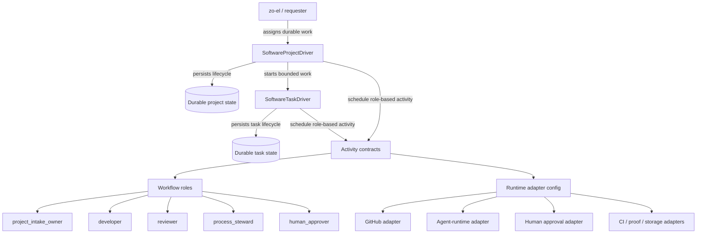
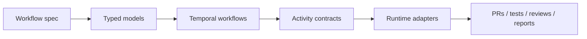

# el-zachariahs-drivers Architecture

This repo externalizes el-zachariah's software-development execution pattern into durable drivers.

The core design is intentionally not tied to Hermes Kanban, Discord, or any single agent transport. Those are adapters. The durable workflow owns state and schedules role-based activities.

## System boundary

The core workflow never depends on a concrete transport such as Kanban, Discord, or a specific agent CLI. Those live behind adapter configuration.

## Design principles

1. **Workflow owns state.** Chat memory is not project state.
2. **Agents are workers.** They execute bounded activities with inputs and acceptance criteria.
3. **Roles are abstract.** The workflow calls `developer`, `reviewer`, `process_steward`, or `human_approver`; adapters bind those roles to real agents/services/channels.
4. **No implicit no-op progress.** A run must produce material progress, a controlled wait, a blocker, done, or failed. Otherwise it is stalled.
5. **Self-recover before escalating.** Task-level findings first return to project plan rethink. Escalate only if the intake outcome changes or outside authority/opinion is needed.
6. **Human gates are explicit.** Spending, credentials, product scope, merge, deploy, and dogfood activation wait for explicit approval signals.

## Layers

## Driver split

- **Project driver**: owns lifecycle, planning, task breakdown, gates, waits, blockers, and final reporting.
- **Task driver**: owns one bounded software task: inspect, implement, test, review/fix loop, complete, block, or request rescope.

The project driver may create many task-driver runs. A small job can still enter the project driver if it needs durable state, but simple one-shot work should go directly to a task driver or normal agent execution.

## v1 build target

The first production slice should not attempt to be a general agent operating system. Build one vertical well:

> assigned software-development intake → plan → bounded tasks → PR → review → validation/proof as configured → feedback/release gates → final report.

The acceptance test for v1 is that a project can be resumed after process restart and still answer: current phase, current task, next trigger, last material progress, blocker owner if any, and final-report path when done.
