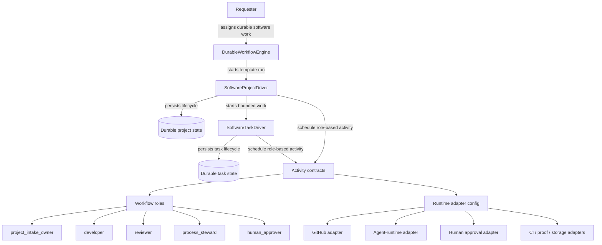

# el-zachariahs-drivers Architecture

This repo defines a reusable durable workflow engine for software project and task execution.

`el-zachariah`'s software-development execution pattern is the first proving template/profile. The core engine should not depend on that worker identity.

The core design is intentionally not tied to Hermes Kanban, Discord, or any single agent transport. Those are adapters. The durable workflow owns state and schedules role-based activities. See [`product_goal.md`](product_goal.md) for the reusable-engine target and non-goals.

## System boundary

The core workflow never depends on a concrete transport such as Kanban, Discord, or a specific agent CLI. Those live behind adapter configuration.

## Design principles

1. **Workflow owns state.** Chat memory is not project state.
2. **Agents are workers.** They execute bounded activities with inputs and acceptance criteria.
3. **Roles are abstract.** The workflow calls `developer`, `reviewer`, `process_steward`, or `human_approver`; adapters bind those roles to real agents/services/channels.
4. **No implicit no-op progress.** A run must produce material progress, a controlled wait, a blocker, done, failed, or cancelled. Otherwise it is stalled.
5. **Self-recover before escalating.** Task-level findings first return to project plan rethink. Escalate only if the intake outcome changes or outside authority/opinion is needed.
6. **Human gates are explicit.** Spending, credentials, product scope, merge, deploy, and dogfood activation wait for explicit approval signals.
7. **Transitions are contract-driven.** Diagrams are explanatory; implementation follows typed events, decisions, activity requests, wait policies, blockers, and evidence references.
8. **Activities are idempotent side-effect boundaries.** Adapters may talk to GitHub, agents, chat, or CI, but core workflows schedule role-based activity requests with idempotency keys and required evidence.
9. **Concrete identities are profile data.** Names like `zo-el`, `el-zachariah`, `Micaiah`, and `el-le` belong in examples/runtime profiles, not core models or reusable workflow templates.
10. **Software gates are configurable.** Pull requests, review, proof, feedback, dogfood, and merge/release are reusable gate concepts, but their concrete tools and required sequence should be template/profile policy.

## Layers

```mermaid
flowchart LR
  ProductGoal[Product goal] --> Spec[Workflow specs]
  Spec --> Contract[Workflow contract]
  Contract --> Models[Typed models]
  Models --> Runtime[Durable runtime backend]
  Runtime --> Workflows[Workflow templates]
  Workflows --> Activities[Activity contracts]
  Activities --> Profiles[Runtime profiles]
  Profiles --> Adapters[Runtime adapters]
  Adapters --> Evidence[PRs / tests / reviews / reports]
```

The contract layer is documented in [`workflow_contract.md`](workflow_contract.md). It is the bridge between product goal, lifecycle diagrams, and implementation: every workflow tick consumes a typed event, emits a typed decision, and records material progress, a controlled wait, a blocker, or a terminal outcome.

## Engine vs template boundary

The reusable product is the durable workflow engine. `SoftwareProjectDriver` and `SoftwareTaskDriver` are the first software-delivery templates running on that engine.

The engine core owns generic capabilities: state persistence, replay, timers, signals, idempotent activity scheduling, evidence references, blocker records, terminal outcomes, and policy evaluation. The software templates own domain-specific states such as planning, task execution, review, proof, feedback, and release gates.

Concrete people, agent names, chat surfaces, repository hosts, and credentials should appear only in runtime profiles/adapters or examples.

## Driver split

- **Project driver**: owns lifecycle, planning, task breakdown, gates, waits, blockers, and final reporting.
- **Task driver**: owns one bounded software task: inspect, implement, test, review/fix loop, complete, block, or request rescope.

The project driver may create many task-driver runs. A small job can still enter the project driver if it needs durable state, but simple one-shot work should go directly to a task driver or normal agent execution.

## v1 build target

The first production slice should not attempt to be a general agent operating system. Build one vertical well, but keep the reusable-engine boundary intact:

> durable software-work intake → plan → bounded tasks → change artifact → review → validation/proof as configured → feedback/release gates → final report.

For a GitHub-backed runtime profile, the change artifact will usually be a PR. For another profile, it might be a patch, branch, package, deployment preview, or local evidence bundle.

The acceptance test for v1 is that a project can be resumed after process restart and still answer: current phase, current task, next trigger, last material progress, blocker owner if any, and final-report path when done.

A second acceptance test is that concrete council/agent bindings can be swapped through a runtime profile without changing engine core models.

Before implementing broad adapters, encode the common [`workflow_contract.md`](workflow_contract.md) model so the state diagrams cannot drift into hidden adapter state or untracked no-op observations.
