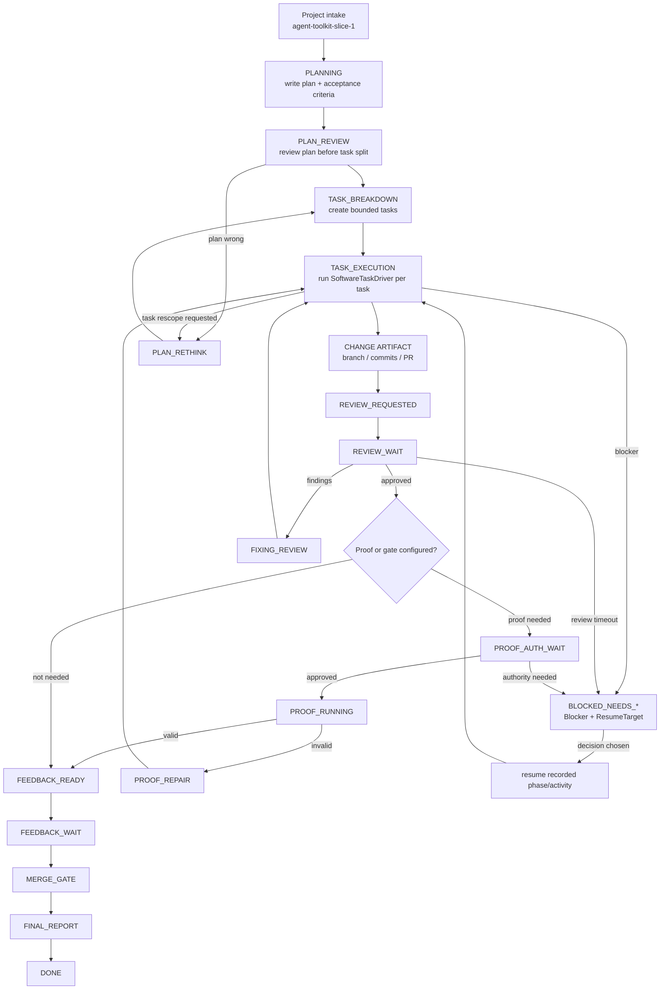
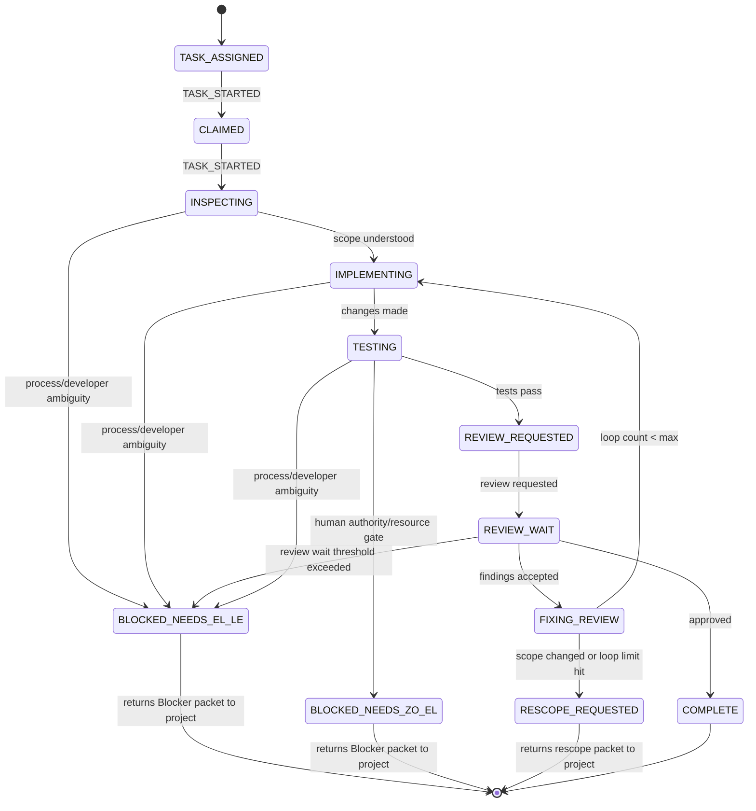
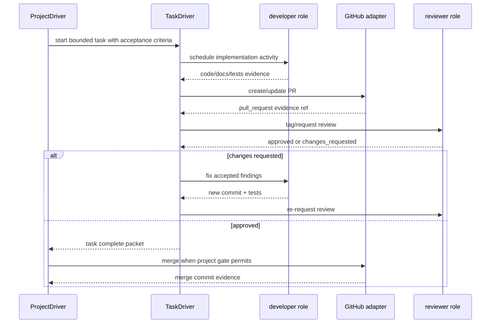

# Example walkthrough: Agent Toolkit Slice 1

This walkthrough shows how the driver would plan and build a concrete project using `examples/agent_toolkit_slice_1.yaml`.

The important point is that the driver is not a chat reminder loop. It owns durable state, emits explicit decisions, schedules role-based activities, records evidence, waits for real review/proof signals, and stops when the project is done.

## Example intake

```yaml
id: agent-toolkit-slice-1
title: Agent Toolkit Slice 1 context-integrity release
repo: /home/zachariah/Documents/el-zachariah/repos/agent-toolkit
pr_url: https://github.com/zo-el/agent-toolkit/pull/51
project_driver: software_project
task_driver: software_task
principles:
  - remote PR is the feedback artifact
  - local-only work is not a milestone
  - Temporal-style workflows own durable state
  - agents perform bounded activities
  - no-op loops must escalate instead of repeating
```

## High-level project run



## What the project driver persists

At every phase the durable state can answer:

- current phase;
- current task, if any;
- next trigger;
- active wait, if any;
- blocker owner and required decision, if blocked;
- resume target for a non-terminal blocker;
- evidence refs;
- last material progress signal;
- terminal outcome, if done/failed/cancelled.

Example state during review wait:

```yaml
workflow_id: project-agent-toolkit-slice-1
driver_kind: SoftwareProjectDriver
phase: REVIEW_WAIT
current_activity:
  activity_id: request-pr-review
  role: reviewer
  requested_at: 2026-07-31T12:00:00Z
wait:
  awaited_signal: review_submitted
  started_at: 2026-07-31T12:00:00Z
  threshold_at: 2026-07-31T12:30:00Z
  retry_policy: single-reminder
  threshold_response: BLOCKED_NEEDS_EL_LE
evidence_refs:
  - type: pull_request
    uri: https://github.com/zo-el/agent-toolkit/pull/51
progress_ledger:
  last_progress_signal: REVIEW_REQUESTED
  no_op_observation_count: 0
```

## Task-driver loop inside `TASK_EXECUTION`

Each project task is smaller than the project. The task driver owns only one bounded implementation/review unit.



A task blocker is not task success. It returns a canonical `Blocker` packet using task phases:

```yaml
blocker:
  owner_role: process_steward
  reason: review wait threshold exceeded
  required_decision: diagnose reviewer availability or choose alternate reviewer
  intake_outcome_preserved: true
  evidence_refs:
    - type: review
      uri: state://review-request/agent-toolkit-slice-1/context-capsule-contract
  resume_target:
    blocked_phase: REVIEW_WAIT
    resume_phase_if_unblocked: REVIEW_REQUESTED
    resume_activity: request_review
    decision_options:
      - decision: reviewer_available
        resulting_phase: REVIEW_WAIT
        notes: continue waiting for existing reviewer response
      - decision: alternate_reviewer
        resulting_phase: REVIEW_REQUESTED
        notes: request a fresh review from the configured alternate reviewer
      - decision: scope_changed
        resulting_phase: RESCOPE_REQUESTED
        notes: return to project PLAN_RETHINK with evidence
```

A project-level proof gate uses the same canonical shape, but with project phases:

```yaml
blocker:
  owner_role: human_approver
  reason: proof run requires authorization
  required_decision: approve proof, skip proof, or cancel release
  intake_outcome_preserved: true
  evidence_refs:
    - type: report
      uri: state://proof-cost-estimate
  resume_target:
    blocked_phase: PROOF_AUTH_WAIT
    resume_phase_if_unblocked: PROOF_RUNNING
    resume_activity: run_proof_packet
    decision_options:
      - decision: approve
        resulting_phase: PROOF_RUNNING
        notes: run proof packet
      - decision: skip
        resulting_phase: FINAL_REPORT
        notes: report skipped proof as explicit gate decision
      - decision: cancel
        resulting_phase: CANCELLED
        notes: stop release work
```

## Concrete PR/review slice loop

For a GitHub-backed runtime profile, each implementation slice uses this loop:



## Example walkthrough in phases

1. `PROJECT_INTAKE_ASSIGNED`
   - Input is accepted as durable work: `agent-toolkit-slice-1`.
   - Output: `PROJECT_ACCEPTED` signal.

2. `PLANNING`
   - Project driver creates a plan with acceptance criteria: context-integrity contract, proof harness, tests, review, and final report.
   - Output: plan evidence ref and `PLAN_CREATED`.

3. `PLAN_REVIEW`
   - Reviewer checks whether the plan is sane before implementation.
   - Findings loop back to `PLAN_RETHINK`; approval moves to task breakdown.

4. `TASK_BREAKDOWN`
   - Driver splits work into bounded tasks:
     - context capsule contract;
     - deterministic proof fixtures;
     - Claude proof runner envelope;
     - review/repair;
     - final report.

5. `TASK_EXECUTION`
   - Each task runs through inspect → implement → test → review.
   - A task may complete, request rescope, or return a blocker packet.

6. `CHANGE ARTIFACT / PR`
   - Remote PR is the feedback artifact. Local-only work is not enough.

7. `REVIEW_WAIT`
   - The driver waits for an actual review signal, not just a tag.
   - If review says changes requested, it fixes and re-requests.
   - If review is approved, it proceeds.

8. `PROOF_AUTH_WAIT` / `PROOF_RUNNING`
   - If proof requires human authority, the blocker records owner, decision, and resume target.
   - After approval, the workflow resumes at `PROOF_RUNNING`, not at done.

9. `FEEDBACK_WAIT`, `MERGE_GATE`, `FINAL_REPORT`
   - Driver waits for configured gates, merges only when authorized, emits a final report, and stops.

## Terminal condition

The driver is done only when durable state records one of:

```yaml
terminal:
  outcome: DONE | FAILED | CANCELLED
  reason: optional string
  final_report_ref: optional string
```

A completed project has no open implementation PR, no unresolved blocker, no active wait, and a final report/evidence trail. At that point any recurring job should remove itself or be removed by the scheduler.
