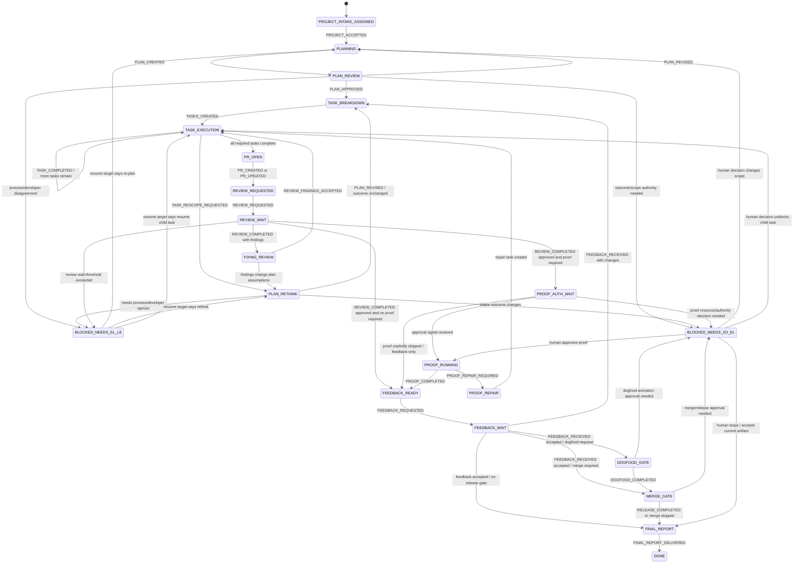

# Software Project Driver Workflow

The software project driver is the outer durable workflow. It manages a project intake, a project milestone, or a durable job that needs lifecycle tracking.

This page defines the lifecycle states. The shared state/event/activity/wait/blocker contract lives in [`../workflow_contract.md`](../workflow_contract.md) and should be implemented before broad adapter work.

## State diagram



## State contract

| State | Purpose | Primary role | Expected outputs | Next decision |
|---|---|---|---|---|
| `PROJECT_INTAKE_ASSIGNED` | A durable work intake exists but is not yet planned. | project intake owner | accepted/rejected intake, initial constraints | move to planning or block for authority |
| `PLANNING` | Produce a project/milestone plan with acceptance and gates. | project intake owner | plan artifact | request plan review |
| `PLAN_REVIEW` | Independent check before task creation. | reviewer | approval or findings | task breakdown, planning revision, or block |
| `PLAN_RETHINK` | Self-recovery after task/review findings reveal plan drift. | project intake owner | revised plan/tasks, unchanged-or-changed outcome assessment | task breakdown or escalation |
| `TASK_BREAKDOWN` | Create bounded task-driver inputs. | project intake owner | task list with acceptance/evidence commands | task execution |
| `TASK_EXECUTION` | Run task drivers until required tasks complete or rescope. | developer/task driver | completed tasks, evidence, rescope requests | continue, rethink, or PR open |
| `PR_OPEN` | Create/update remote feedback artifact. | developer | PR URL/head | review request |
| `REVIEW_REQUESTED` | Request review once and record evidence. | project driver/adapters | review request evidence | review wait |
| `REVIEW_WAIT` | Wait for reviewer result with threshold. | reviewer | review approval/findings | fix, proof, feedback, or process block |
| `FIXING_REVIEW` | Turn review findings into task-driver repair work. | developer | accepted findings, repair tasks | task execution or plan rethink |
| `PROOF_AUTH_WAIT` | Wait for explicit proof/resource approval when required. | human approver | approval/denial signal | proof running, feedback-only, or block |
| `PROOF_RUNNING` | Execute approved proof under current controls. | proof runner/developer | proof packet/evidence | feedback ready or proof repair |
| `PROOF_REPAIR` | Repair proof harness/control problems. | developer | repair task | task execution |
| `FEEDBACK_READY` | Artifact is ready for user feedback. | project driver | feedback request | feedback wait |
| `FEEDBACK_WAIT` | Wait for feedback window/result. | human approver/requester | feedback accepted/changes | tasks, dogfood, merge, or final report |
| `DOGFOOD_GATE` | Real-use validation gate if configured. | human approver/developer | dogfood approval/evidence | merge gate or block |
| `MERGE_GATE` | Merge/release decision gate if configured. | human approver | merge/release approval/evidence | final report or block |
| `FINAL_REPORT` | Produce final evidence-backed report. | project intake owner | final report | done |
| `DONE` | Terminal success. | workflow | immutable summary | none |
| `BLOCKED_NEEDS_EL_LE` | Process/developer unblock needed. | process steward | decision or diagnosis | resume or rethink |
| `BLOCKED_NEEDS_ZO_EL` | Human authority/resource/product gate. | human approver | decision | resume, stop, or revise |

Blocker transitions do not imply a generic jump to the end of a task or project. A blocker records a resume target: the blocked phase, allowed decision options, and the phase/activity to resume after resolution. The project driver uses that target to resume a child task, re-plan, continue proof/release work, cancel, or fail under policy.

This is an application of the reusable engine contract. The project template owns these phase names; the engine core only requires that non-terminal blockers carry replayable resume targets.

## Terminal and failure policy

`DONE` is the successful terminal outcome. `FAILED` and `CANCELLED` are shared terminal outcomes from the workflow contract, not ordinary lifecycle phases:

- `FAILED` means the workflow cannot continue safely under the current contract, retry policy, or available evidence.
- `CANCELLED` means an authorized owner stopped or rejected the intake before completion.
- `BLOCKED_NEEDS_*` states are not terminal; they preserve the resume target and required decision.

A project driver should not convert a blocker into failure unless the blocker policy or authorized decision says the run must stop.

## Project decision packet

Each project-driver transition should emit a decision packet that includes:

```yaml
project_id: string
from_phase: string
to_phase: string
material_progress: boolean
progress_signal: optional string
activities_to_schedule:
  - activity_id: string
    role: project_intake_owner | developer | reviewer | proof_runner | process_steward | human_approver
    acceptance_criteria:
      - string
wait_to_start: optional
  awaited_signal: string
  threshold_at: timestamp
blocker_to_record: optional Blocker
evidence_refs:
  - type: plan | task | commit | pull_request | review | proof | report | adapter_record
    uri: string
terminal_outcome: optional DONE | FAILED | CANCELLED
```

This packet is what makes `TASK_EXECUTION`, waits, blockers, and final reporting replayable after restart.

## Role contract

The workflow calls roles, not concrete people, chat surfaces, or queues.

| Role | Responsibility | Typical bound actor in zo-el council | Output type |
|---|---|---|---|
| `project_intake_owner` | Own plan, rethink, task breakdown, final report. | el-zachariah | plan, task list, final report |
| `developer` | Execute bounded tasks and repairs. | el-zachariah | commits, PR updates, test evidence |
| `reviewer` | Independent plan/code/proof review. | Micaiah or configured reviewer | approval/findings |
| `proof_runner` | Run approved proof/validation packet. | configured agent/service | proof evidence |
| `process_steward` | Diagnose workflow/process/dispatch ambiguity. | El-Le/default-equivalent | process decision |
| `human_approver` | Product/resource/merge/dogfood authority. | zo-el/requester | approval/denial/scope decision |

Runtime adapter config binds these roles to concrete tools. The workflow should not hardcode Kanban, Discord, Hermes profile names, or GitHub review mechanics.

## Wait and stall policy

Every wait state must define an awaited signal and an escalation threshold.

| Wait state | Awaited signal | Controlled wait output | Threshold response |
|---|---|---|---|
| `REVIEW_WAIT` | review approval/findings | `WAIT_TIMER_STARTED` or `RETRY_SCHEDULED` | `BLOCKED_NEEDS_EL_LE` |
| `PROOF_AUTH_WAIT` | human approval/denial signal | `WAIT_TIMER_STARTED` | `BLOCKED_NEEDS_ZO_EL` only when explicit decision is required |
| `FEEDBACK_WAIT` | feedback accepted/changes signal | `WAIT_TIMER_STARTED` | final reminder or `BLOCKED_NEEDS_ZO_EL` |
| `DOGFOOD_GATE` | dogfood approval/evidence | `WAIT_TIMER_STARTED` | `BLOCKED_NEEDS_ZO_EL` |
| `MERGE_GATE` | merge/release approval/evidence | `WAIT_TIMER_STARTED` | `BLOCKED_NEEDS_ZO_EL` |

A repeated observation of the same state is never progress. It is valid only if the run also records a controlled wait with a timer/signal condition.

## Run invariant

Every project-driver tick/activity completion must result in exactly one of:

1. material progress signal;
2. controlled wait with timer/signal condition;
3. blocker with owner role and required decision;
4. terminal done/failed/cancelled outcome.

If none is produced, the run is `STALLED` and should be treated as a workflow failure, not as progress. `STALLED` is a diagnosis that must immediately produce a retry, blocker, failure, or cancellation decision; it should not become another quiet holding phase.
