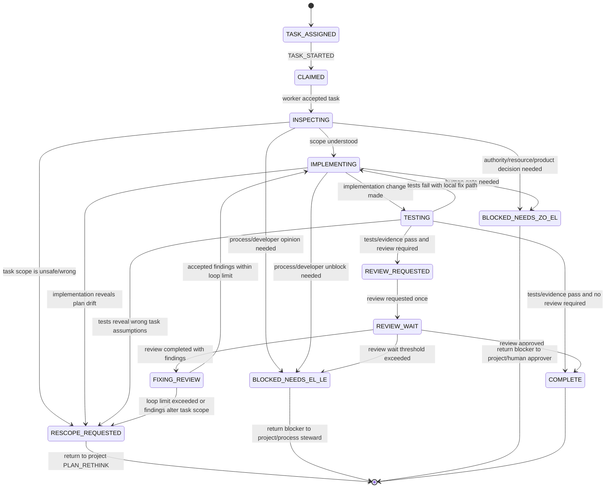

# Software Task Driver Workflow

The software task driver is the bounded inner workflow. It executes one task created by the project driver or directly assigned when a job is small enough to avoid full project orchestration.

This page defines the task lifecycle. The shared state/event/activity/wait/blocker contract lives in [`../workflow_contract.md`](../workflow_contract.md) and defines the durable packet a task returns to the project driver.

## State diagram



## State contract

| State | Purpose | Primary role | Expected outputs | Next decision |
|---|---|---|---|---|
| `TASK_ASSIGNED` | Bounded task input exists. | task driver | claimable work package | claimed |
| `CLAIMED` | Worker accepted task ownership. | developer | task claim evidence | inspect |
| `INSPECTING` | Read repo/context before changing files. | developer | understanding, affected paths, verification plan | implement, rescope, or block |
| `IMPLEMENTING` | Make bounded changes. | developer | code/docs/config changes | testing, rescope, or block |
| `TESTING` | Produce executable evidence. | developer | test/proof/lint result | review, complete, implement again, or rescope |
| `REVIEW_REQUESTED` | Request review once with evidence. | developer/adapters | review request evidence | review wait |
| `REVIEW_WAIT` | Wait for review with threshold. | reviewer | approval/findings | complete, fix, or process block |
| `FIXING_REVIEW` | Apply accepted review findings as a directed repair set. | developer | fixed findings, updated evidence | implement/test or rescope |
| `RESCOPE_REQUESTED` | Task discovered the plan/intake needs rethinking. | task driver | rescope reason and evidence | return to project `PLAN_RETHINK` |
| `COMPLETE` | Terminal task success. | task driver | completion evidence | return to project |
| `BLOCKED_NEEDS_EL_LE` | Process/developer unblock needed. | process steward | precise blocker | return to project |
| `BLOCKED_NEEDS_ZO_EL` | Human authority/resource/product gate. | human approver | precise blocker | return to project |

## Terminal and failure policy

`COMPLETE` is the successful task outcome. A task may also return shared terminal outcomes from the workflow contract:

- `FAILED` when the task cannot continue safely after its retry/review-loop policy is exhausted and the failure does not require a planning rethink.
- `CANCELLED` when the project driver or authorized owner stops the task.

`RESCOPE_REQUESTED` and `BLOCKED_NEEDS_*` are not terminal failure claims by themselves. They are structured returns to the project driver with enough evidence for `PLAN_RETHINK`, process unblock, or human authority.

## Review repair loop

`FIXING_REVIEW` is a bounded directed loop, not an infinite patch cycle.

Rules:

1. Review findings become a repair packet: finding id, severity, disposition, fix plan, affected files, verification command.
2. The developer fixes all accepted findings that safely fit the task scope.
3. Each pass increments `review_loop_count`.
4. When `review_loop_count >= max_review_loops`, or a finding changes task assumptions, the task emits `RESCOPE_REQUESTED` instead of looping again.
5. `RESCOPE_REQUESTED` returns control to the project driver's `PLAN_RETHINK` state before escalating.

## Task output shape

A completed or blocked task should return:

```yaml
task_id: string
phase: COMPLETE | RESCOPE_REQUESTED | BLOCKED_NEEDS_EL_LE | BLOCKED_NEEDS_ZO_EL | FAILED | CANCELLED
evidence_refs:
  - type: command | commit | pull_request | review | proof | adapter_record
    uri: string
    digest: optional string
rescope_reason: optional string
blocker: optional
  owner_role: process_steward | human_approver
  reason: string
  required_decision: string
progress_signals:
  - TASK_COMPLETED | TASK_RESCOPE_REQUESTED | BLOCKER_CREATED | TASK_FAILED | TASK_CANCELLED
activity_results:
  - activity_id: string
    idempotency_key: string
    accepted: boolean
    evidence_refs:
      - string
```

## Task run invariant

A task-driver run must not end with a silent observation. It must emit one of:

- material progress: code changed, test evidence created, review requested/completed, findings fixed, task completed;
- controlled wait: review wait timer or retry scheduled;
- rescope: `RESCOPE_REQUESTED` with evidence and reason;
- blocker: owner role plus required decision;
- terminal failed/cancelled/done.

If it emits none, the task run is `STALLED` and the project driver should not count it as progress. `STALLED` should be converted immediately into a retry, blocker, rescope, failure, or cancellation decision; it should not become another background wait state.
